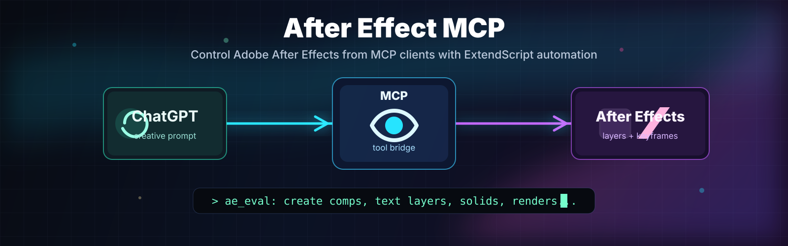

# After Effect MCP



Local MCP server for Codex, OpenCode, Gemini, Qwen, and other local MCP clients that lets an AI assistant inspect and automate Adobe After Effects through ExtendScript.

The server runs over MCP stdio, launches `afterfx.com` or `AfterFX.exe` with a temporary JSX wrapper, and returns structured JSON results back to the MCP client.


## Requirements

- Node.js 18 or newer.
- Adobe After Effects installed.
- After Effects scripting access enabled:
  `Edit > Preferences > Scripting & Expressions > Allow Scripts To Write Files And Access Network`.
- For live automation, keep After Effects open before calling MCP tools.

## Quick Setup

This repo is set up for `pnpm` and local MCP stdio clients.

```powershell
pnpm install
pnpm build
```

Preview the client config changes before writing anything:

```powershell
pnpm install:clients -- --dry-run --allowed-dir=D:\AI\DREAM-PIXELS-FORGE --afterfx-path="D:\Program Files\Adobe\Adobe After Effects 2025\Support Files\AfterFX.exe"
```

Install the MCP config for supported local clients:

```powershell
pnpm install:clients -- --allowed-dir=D:\AI\DREAM-PIXELS-FORGE --afterfx-path="D:\Program Files\Adobe\Adobe After Effects 2025\Support Files\AfterFX.exe"
```

The installer updates:

- Codex: `~/.codex/config.toml`
- OpenCode: `~/.config/opencode/opencode.json`
- Gemini: `~/.gemini/settings.json`
- Qwen: `~/.qwen/settings.json`

You can target specific clients:

```powershell
pnpm install:clients -- --clients=codex,opencode
```

`--allowed-dir` controls which folders AE file tools may touch through `MCP_ALLOWED_DIRS`. `--afterfx-path` is optional when auto-detection works, but passing it makes startup deterministic.

ChatGPT Desktop is not configured by this installer because ChatGPT custom MCP/apps require a remote HTTP/SSE or Streamable HTTP MCP endpoint, not a local stdio process. Use [ChatGPT Desktop / Web](#chatgpt-desktop--web) for that path.

## Legacy Setup

The package still supports setup and uninstall commands:

```powershell
pnpm run setup
pnpm run uninstall
```

Those commands copy the CEP extension and update supported client configs through the built CLI.

## 🛠️ Manual Install

If you prefer to set up manually:

1. **Install Dependencies & Build**:
   ```powershell
   pnpm install
   pnpm build
   ```
2. **Copy CEP Extension**: Copy `cep-extension/` folder to After Effects `CEPPlugIns` folder.
3. **Configure MCP Client**: Follow the instructions in [Connecting to MCP Clients](#connecting-to-mcp-clients).

## 🗑️ Uninstalling

If you need to remove the MCP server and its components:

### Automated Uninstall

```powershell
pnpm run uninstall
```

### Manual Uninstall

1. **Remove CEP Extension**: Delete `AE-MCP-Bridge` folder from your AE `CEPPlugIns` folder.
2. **Clean Config**: Remove the `after-effects` entry from your MCP client config.
3. **Delete Project**: Delete the `after-effect-mcp` directory.

## 🔌 Connecting to MCP Clients

### OpenCode

Add to your `opencode.jsonc`:

```jsonc
{
  "mcp": {
    "after_effects": {
      "type": "local",
      "command": ["node", "D:\\AI\\DREAM-PIXELS-FORGE\\EXTENSIONS\\OPENCODE\\after-effect-mcp\\build\\index.js"],
      "enabled": true,
      "environment": {
        "MCP_ALLOWED_DIRS": "D:\\AI\\DREAM-PIXELS-FORGE",
        "AFTERFX_PATH": "D:\\Program Files\\Adobe\\Adobe After Effects 2025\\Support Files\\AfterFX.exe"
      }
    }
  }
}
```

### Codex

Add to `~/.codex/config.toml`:

```toml
[mcp_servers.after_effects]
command = "node"
args = ['D:\AI\DREAM-PIXELS-FORGE\EXTENSIONS\OPENCODE\after-effect-mcp\build\index.js']
enabled = true

[mcp_servers.after_effects.env]
MCP_ALLOWED_DIRS = 'D:\AI\DREAM-PIXELS-FORGE'
AFTERFX_PATH = 'D:\Program Files\Adobe\Adobe After Effects 2025\Support Files\AfterFX.exe'
```

### Gemini and Qwen

Add this to `~/.gemini/settings.json` or `~/.qwen/settings.json`:

```json
{
  "mcpServers": {
    "after-effects": {
      "command": "node",
      "args": [
        "D:\\AI\\DREAM-PIXELS-FORGE\\EXTENSIONS\\OPENCODE\\after-effect-mcp\\build\\index.js"
      ],
      "env": {
        "MCP_ALLOWED_DIRS": "D:\\AI\\DREAM-PIXELS-FORGE",
        "AFTERFX_PATH": "D:\\Program Files\\Adobe\\Adobe After Effects 2025\\Support Files\\AfterFX.exe"
      }
    }
  }
}
```

### Claude Desktop / VSCode MCP Clients

Use the same `mcpServers` shape as Gemini and Qwen. Put it in the config file for the client you are using.

### ChatGPT Desktop

ChatGPT custom MCP/apps do not currently launch local stdio commands directly. This repo includes a Streamable HTTP bridge for that path.

Start the HTTP bridge locally:

```powershell
pnpm build
$env:AE_MCP_HTTP_TOKEN="choose-a-long-random-token"
$env:AE_MCP_HTTP_HOST="127.0.0.1"
$env:AE_MCP_HTTP_PORT="3927"
pnpm run start:http
```

Local endpoint:

```text
http://127.0.0.1:3927/mcp
```

For ChatGPT, expose that local endpoint through a secure HTTPS tunnel such as Cloudflare Tunnel or ngrok, then add the public HTTPS `/mcp` URL in ChatGPT developer mode. Configure the app/connector with bearer auth using the same `AE_MCP_HTTP_TOKEN`.

Architecture:

```text
ChatGPT
  -> HTTPS tunnel URL /mcp
    -> after-effect-mcp Streamable HTTP bridge
      -> After Effects on this machine
```

Do not expose the bridge publicly without authentication. This MCP can modify After Effects projects and run ExtendScript.

## Available Tools

- `ae_find_executable`: find the After Effects executable used by the server.
- `ae_project_summary`: inspect the open project, active item, comps, footage, folders, and render queue.
- `ae_eval`: run ExtendScript in After Effects and return JSON-serializable data. (Sandboxed: dangerous commands like `app.system` are blocked).
- `ae_run_script_file`: run an existing `.jsx` or `.jsxbin` file.
- `ae_create_comp`: create a composition.
- `ae_list_comps`: list project compositions.
- `ae_add_text_layer`: add a text layer to a composition.
- `ae_add_solid`: add a solid layer to a composition.
- `ae_import_file`: import media or project files.
- `ae_open_project`: open an `.aep` project file.
- `ae_save_project`: save the current project.
- `ae_queue_render`: add a comp to the render queue without starting render.

## Example Prompts

```text
Use the after_effects MCP tool to summarize the open After Effects project.
```

```text
Create a new 1920x1080 composition named mcp_gpt_test.
```

```text
Create a simple animated title sequence in After Effects with text layers and keyframes.
```


## Example `ae_eval`

Use ES3 ExtendScript syntax. After Effects ExtendScript does not support modern JavaScript features like `let`, `const`, arrow functions, promises, classes, or modules.

```javascript
if (!app.project) app.newProject();
app.beginUndoGroup("MCP Example");
try {
  var comp = app.project.items.addComp("MCP Test", 1920, 1080, 1, 5, 30);
  var text = comp.layers.addText("Hello from MCP");
  text.property("Transform").property("Position").setValue([960, 540]);
  comp.openInViewer();
  return { comp: comp.name, layer: text.name };
} finally {
  app.endUndoGroup();
}
```

## Tests

All project tests have been run successfully during implementation.

Completed checks:

- `pnpm test`: passed.
- TypeScript build: passed.
- After Effects executable path check: passed.
- MCP stdio tool discovery smoke test: passed.
- Live After Effects CEP extension test: passed after After Effects was opened.

Do not rerun live After Effects tests unless After Effects is open and you explicitly want to exercise the running application.

Useful commands:

```powershell
pnpm test
```

```powershell
pnpm smoke:http
```

```powershell
pnpm test:live
```

## Notes

- MCP stdio servers must not write normal logs to stdout because stdout carries JSON-RPC protocol messages.
- This server writes errors to stderr only.
- `ae_eval` scripts should return JSON-serializable values.
- For reliable automation, keep After Effects open before calling tools.

## Security

### Security Model

This MCP server executes Adobe ExtendScript code in After Effects. Key security features:

- **ExtendScript Whitelist**: Blocks dangerous patterns (`app.system`, `File.write`, `eval(`, etc.)
- **Path Validation**: All file operations restricted to allowed directories via `MCP_ALLOWED_DIRS`
- **Executable Validation**: After Effects executable path is validated
- **Rate Limiting**: 100 requests per minute per client
- **Source Maps Disabled**: No source map files in production builds

### Environment Variables

| Variable             | Purpose                                              | Default           | Security                  |
| -------------------- | ---------------------------------------------------- | ----------------- | ------------------------- |
| `AFTERFX_PATH`       | Explicit After Effects executable path               | Auto-detect       | Validated                 |
| `AFTER_EFFECTS_PATH` | Alternative path variable                            | Auto-detect       | Validated                 |
| `MCP_ALLOWED_DIRS`   | Semicolon-separated allowed directories for file ops | Current directory | **Required for security** |
| `AE_MCP_HTTP_TOKEN`  | Bearer token for the HTTP bridge                     | Disabled          | **Required before exposing** |
| `AE_MCP_HTTP_HOST`   | HTTP bridge host                                     | `127.0.0.1`       | Use localhost unless tunneling |
| `AE_MCP_HTTP_PORT`   | HTTP bridge port                                     | `3927`            | Local listener port       |
| `AE_MCP_HTTP_ORIGINS`| Comma-separated CORS allow-list                      | Disabled          | Enable only for browser clients |

### Security Audit

A comprehensive security audit and remediation was completed on 2026-05-04:

- **15 vulnerabilities fixed** (5 Critical, 5 High, 5 Medium)
- **Zero critical or high-risk vulnerabilities remaining**
- **Improved ExtendScript Sandbox**: Blocks bracket-notation bypasses and dangerous file/system operations.
- **Strict Path Validation**: All file-related tools (import, open, save, render) now strictly enforce `MCP_ALLOWED_DIRS`.

See `docs/SECURITY.md` for full audit details and remediation history.

### CEP Extension (Recommended)

The CEP extension runs inside After Effects for more reliable execution:

1. **Auto-install**: Run `pnpm run setup` to automatically copy the CEP extension
2. **Manual install**: Copy `cep-extension/` folder to:
   - **Windows**: `C:\Program Files\Adobe\Adobe After Effects <version>\Support Files\CEPPlugIns\`
   - **macOS**: `/Applications/Adobe After Effects <version>/CEPPlugIns/`
3. **Enable in AE**: Go to `Window > Extensions > AE MCP Bridge`
4. **Auto Process**: Turn on "Auto Process" in the panel for automatic command handling

### File Bridge Mode

For environments that need file-based communication:

```powershell
pnpm run start:bridge
```

This uses the CEP extension to execute commands reliably without stdio.

### Streamable HTTP Bridge

For ChatGPT or any client that needs remote MCP over HTTP:

```powershell
$env:AE_MCP_HTTP_TOKEN="choose-a-long-random-token"
pnpm run start:http
```

The MCP endpoint is `http://127.0.0.1:3927/mcp` by default. Use a secure HTTPS tunnel for remote clients.

### Report Security Issues

For security concerns, review `docs/SECURITY.md` or open an issue with the "security" label.
